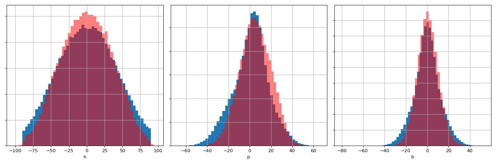
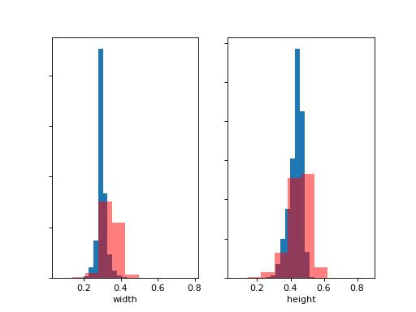

# Replicantface dataset

This dataset has the synthetic faces with pose annotations and full 3d landmarks.
As the format is like AFLW2k-3D / 300W-LP, it has the following characteristics:

* 640 x 640 pixel jpg images
* `.mat` label files, containing
* `'Pose_Para': [[pitch, yaw, roll, tx, ty, tz, scale]]`
* `pt3d_68`: 3 x 64 point landmarks array
* `roi`: Bounding box in x0,y0,x1,y1 format. Here it is straight forward the bounding box in the same coordinate
    space as `tx` and `ty`. (In AFLW2k-3D / 300W-LP this is not the case.)

The segmentation masks are omitted.

## Benchmarking results on AFLW2k-3D

Mixing in 8% Replicantface into other training data.

|  Variant                  |  Pitch°     |    Yaw°     |      Roll°     |     Mean°     |     Geodesic°    |
| ------------------------- | ----------- | ----------- | -------------- | ------------- | ---------------- |
| Baseline                  | 4.15        | 2.69        |  2.51          |   3.12        | 5.15             |
| w/ Replicantface          | 4.13        | 2.69        |  2.51          | **3.11**      |**5.11**          |
| wo/ LMK                   | 4.16        | 2.70        |  2.53          |   3.13        | 5.15             |
| wo/ LMK, w/ Replicantface | 4.14        | 2.69        |  2.51          | **3.11**      |**5.12**          |

(Metrics averaged over four networks.)

By default, I use auxiliary landmark predictions (to be able to use FaceSynthetics). For the results labeled "wo /LMK"
it was disabled.

The benefits are small. However, there might be benefits which are not captured in the benchmark, e.g. better generalization to glasses and pronounced facial expressions. Need more analysis.

## Details

Regarding diversity there are different skin tones and textures and face shapes reasonably uniformly sampled (I think).
There are around 30 accessories like glasses, hats, masks, helmets and headphones,
90 backgrounds, around 10 hairstyles, and different facial expressions. Eye movements are also present.

The distribution of poses is shown in the following plots. Blue is Replicantface and red is FaceSynthetics. To get the pose
distribution for FaceSynthetics I used a pose estimation network. They are only pseudo labels.



One notable thing is the bias to ca 5 deg. pitch. This was important for maximizing the benchmark score on AFLW2k-3D and matching my networks performances with training on FaceSynthetics.

Beware that the default settings for ReplicantFace will not produce this distribution. The current data stems from a combination of the default with a correction with more samples which I added later to achieve the pitch bias. See below.

The bounding boxes are created from facial vertices. Samples with bounding boxes (based on the face segmentation this time) smaller than 32 pixels were filtered out. Samples with yaw larger than 90 deg were also filtered.

The size distribution of the bounding boxes is shown next. The faces only fill half of the images to allow for
shift augmentation with visible background.



Considering the **depth coordinates** of landmarks, we have to recognize that their relative
differences across the face is essential. On the other hand, their center of mass will in general be different
from dataset to dataset or even face to face. Since there is next to no information in the images to derive an absolute
depth from, an ML algorithm could learn at most an offset for the entire dataset.
Therefore, caution must be exercised especially when combining datasets of different origin.

This dataset comes with the point between the eyes centered at zero. I.e. by
```Python
def depth_centered_keypoints(kpts):
    eye_corner_indices = [45, 42, 39, 36]
    center = np.average(kpts[:,eye_corner_indices], axis=1)
    kpts = np.array(kpts, copy=True)
    kpts[2] -= center[2]
    return kpts
```
When labels are made consistent by such means, there should be no problems. Of course an appropriate loss can also be
used.


## Details about the pitch correction

75k samples were created with the default setting at the time of this writing.
[Link to tag](https://github.com/DaWelter/replicantface/tree/release-replicant-face-v4-like-300wlp-zip).
Then 25k more were created with a patch to `randomize_pose.py` which is shown
in [this comparison](https://github.com/DaWelter/replicantface/compare/release-replicant-face-v4-like-300wlp-zip...pose-distribution-change-like-synface)
