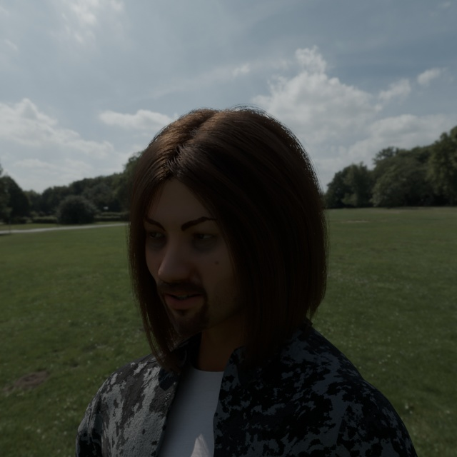
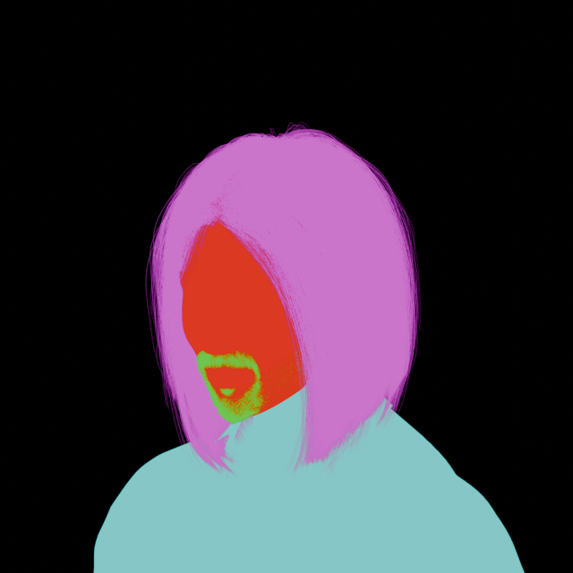

# Raw data

## Description

This directory contains a raw data sample. Not in 300W-LP format.

Labels are generated by `export_face_params` in `replicantface/export.py`

```Python

    np.savez_compressed(str(label_path),
                        modelview = np.asarray(m_cam, dtype=np.float32),
                        projection = np.asarray(proj_matrix, dtype=np.float32),
                        vertices = np.asarray(vertices, dtype=np.float16),
                        resolution = render.resolution_x)
```

The `vertices` are defined w.r.t. the models local coordinates. The `modelview` matrix (4x4) describes the position and
orientation of the head relative to the camera. `projection` is the usual projection matrix (4x4) for pinhole cameras
from computer graphics, mapping to [-1,1] normalized screen space. `resolution` is just the image size, currently always
640, added for convenience.

The segmentation colors should have been primary colors, but due to how Blender apparently works and me not
noticing early enough, they ended up distorted. At boundaries, they are blended smoothly.
```python
COLOR_FACE = (220,57,33)
COLOR_BEARD = (118,190,70)
COLOR_CLOTHES = (135,198,199)
COLOR_BG = (0,0,0)
```

## Sample

* `face_{counter:5d}.npz` as described above

 [face_00000.npz](face_00000.npz)

* `face_{counter:5d}_img.npz` the visual images



* `face_{counter:5d}_mask.npz` the visual images

