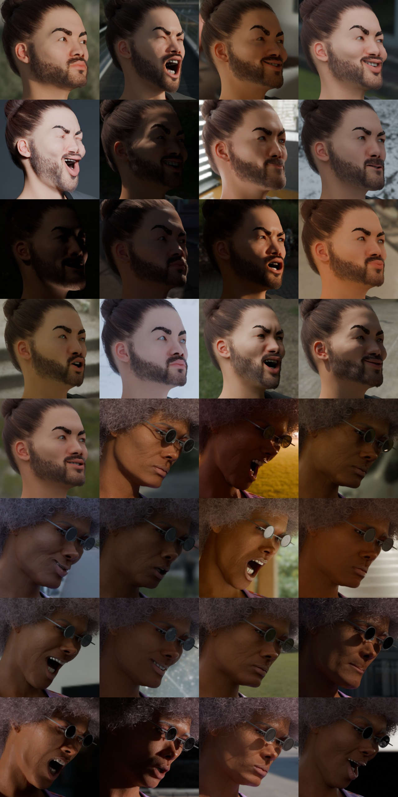

# Replicantface

This project is about rendering synthetic faces with pose annotations. It is intended for
head pose estimation with machine learning, where labeling natural in-the-wild faces is notoriously difficult.

A dataset is provided as well as scripts and (the free) assets used to create the dataset.
The project is based on [Blender](https://www.blender.org/) for photorealistic rendering and
[Human Generator](https://blendermarket.com/products/humgen3d) to provide the character models.

Faces are randomized with a great variety of different poses, face shapes, expressions, skin textures, hairstyles,
accessories, eye movements, backgrounds and lighting.

To carry this out, a rather large volume of python code controls the character generation and other parameters.

Exported annotations are segmentation mask, 6dof pose, and dense vertices.
A script is provided to convert to the popular Matlab format from [3DDFA](http://www.cbsr.ia.ac.cn/users/xiangyuzhu/projects/3DDFA/main.htm) / AFLW2k-3D / 300W-LP.

## Related work

Replicantface is heavily inspired by [FaceSynthetics](https://github.com/microsoft/FaceSynthetics), motivated by its lack of pose
annotations and missing z-coordinate for landmarks. Another dataset called "SynHead" from [Dynamic Facial Analysis](https://research.nvidia.com/publication/2017-07_dynamic-facial-analysis-bayesian-filtering-recurrent-neural-network) was very limited in variety and without hair.

## The dataset

There is a prepared dataset with 100k faces, full pose annotations and 68 3d landmarks in AFLW2k-3D / 300W-LP format.
[Download from Google Drive](https://drive.google.com/file/d/1lF2hWGPKuXahIvg-0CtZG154d82_w19k/view?usp=drive_link)

A 10k variant is available as well. It has different samples, so it is suitable as test set.
[Download 10k variant](https://drive.google.com/file/d/1CLdL542XRHFVmNmOAQGyX7mO4HnJsle0/view?usp=drive_link)

More info can be found under [dataset.md](doc/dataset.md) and [rawdata.md](doc/rawdata/rawdata.md)

Full size image with visu

Closeups

## Less randomized datasets

Currently, there is small dataset with `32` faces in random poses, where these faces are held fixed and for each of them
there is one neutral and `32` variations in facial expression and background.

[Download the 1k pose-stability-test](https://drive.google.com/file/d/1MO7n0cqEHfDkCArw9FrG1NrLy6G2fRz1/view?usp=drive_link)

This can be used to analyze variance due to facial expressions and illumination separately from other factors. E.g. we
want pose-predictions to remain stable when the user is talking and not moving. Same while subjected to varying illumination
by a computer screen for instance. The `make_faces.py` script supports this and the normal variant.

## Usage

This project will not work out of the box. First, get HumGen3d for Blender.

Install the replicantface package in Blenders Python distribution. This way the main script can conveniently import
all the submodules. The `-e` causes symlinks to be created such that changes in the original source are reflected in the
installed package. You can use `pip uninstall` to remove the package again.
`<blender dir>/<version>/python/bin/python* -m pip install -e .` 

Then consider the scene assets. See [assets/readme.md](assets/readme.md). At least some backgrounds would be requried.
You can download any HDRI you want and place them in the `hdris` folder. For the HDRIs listed, the `randomize_env` module 
has multipliers to make the brightness more uniform.

The paid accessories are not in this repo for obvious reasons. The scripts
will work without them. For more variety get assets to your preference, put them next to the existing assets in the scene
hierarchy in (`human_scene-v3.blend`), ensure they fit the human model, and adjust material assignments. You can use the
current models as guideline. The script `replicantface/add_accessories.py`, to be used from blenders script editor, can
merge external scenes with accessories into the main scene `human_scene-v3.blend`. The module 
`replicantface/randomize_accessoires.py` must then be changed. Its main
responsibility is random sampling of accessories and prevention of unreasonable combinations. The issue hereby is that
it contains hardcoded names and logic for the missing paid models that the author happened to use.

The last step involving the assets is copying the files from `assets/humgen-assets` to HumGen3D's true asset folder.

Afterwards things should be ready to go. `make_faces.py` is the main entry point. It can be loaded in Blenders script
editor and ran interactively. The same can be done with the modules in `replicantface` which is useful for development.
After generating a random human, it renders, composits and dumps the image, segmentation mask and labels to disk.

For generating datasets, take a look at `run_blender.py`. It runs Blender in headless mode and executes `make_faces.py`.
The raw labels contain dense face vertices, the model-view transformation matrix (thus the head pose), and projection matrix.
They can be converted by `auxiliary_scripts/convert_to_300wlp_type_dataset.py` to the AFLW2k-3D / 300W-LP format.

The pose distribution has been fixed now to be very similar to FaceSyn which should yield good benchmark results when a new dataset is generated. The relevant code is found in `replicantface/randomize_pose.py`: `randomize_camera` and `randomize_pose`. (Initially, the distribution was suboptimal, and the dataset had to be fixed in hindsight as described in [dataset.md](doc/dataset.md))
